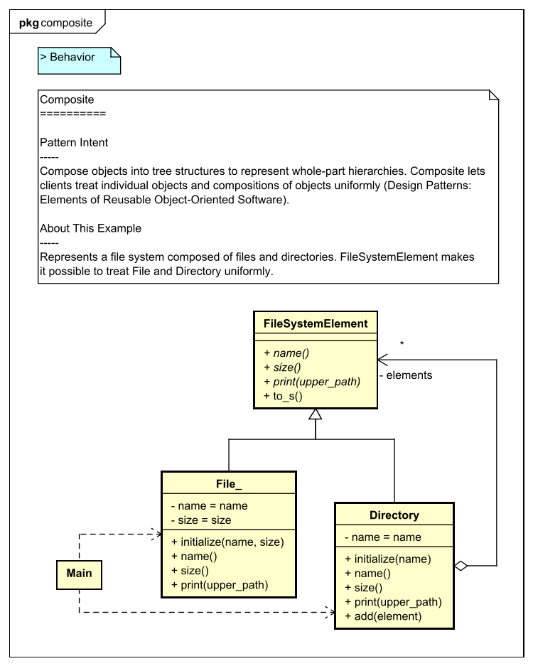
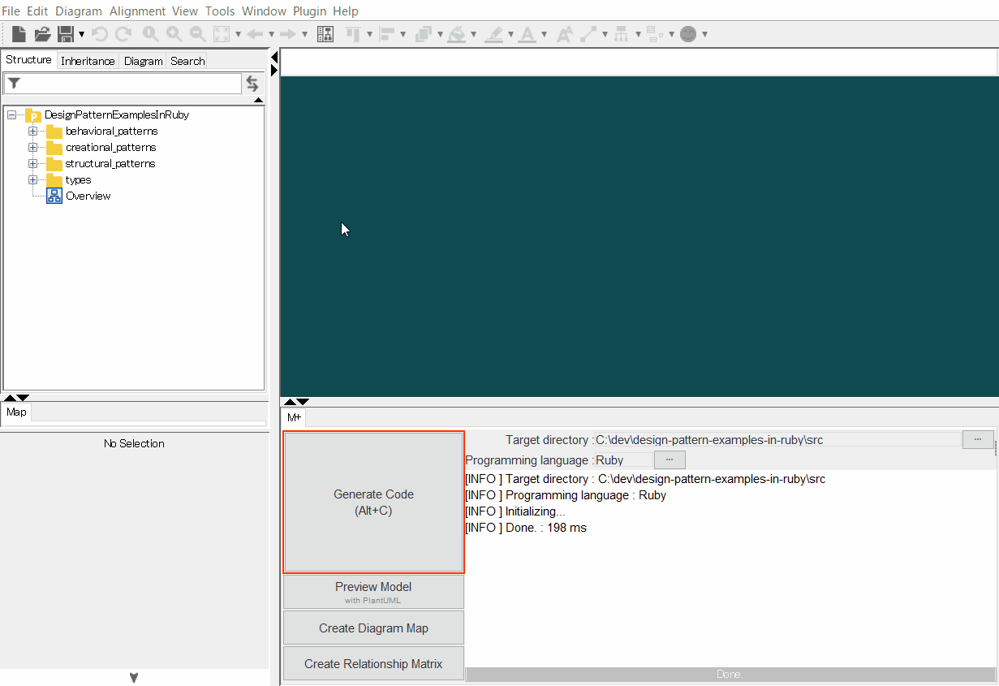
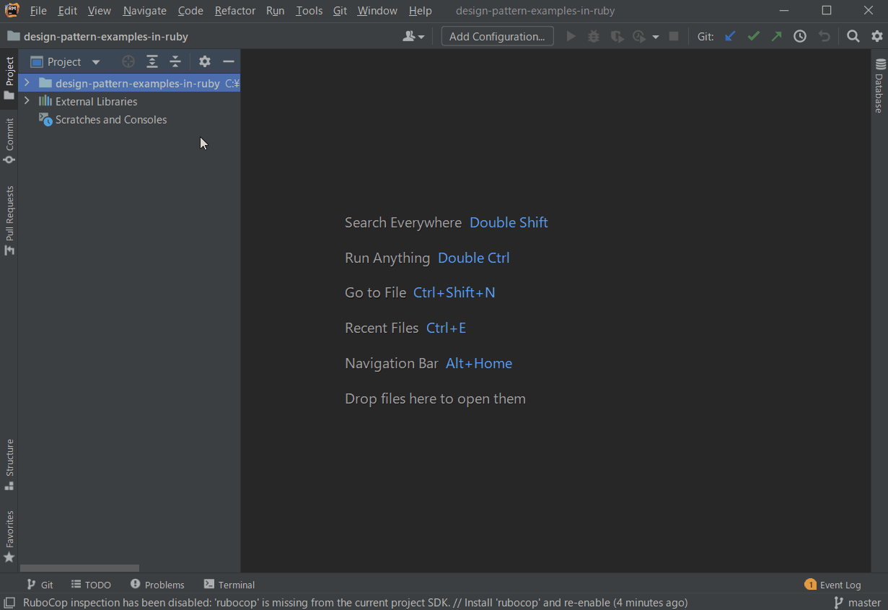

[](https://raw.githubusercontent.com/takaakit/design-pattern-examples-in-ruby/master/screenshots/DiagramMap.svg)

Design Pattern Examples in Ruby
===

Model and code examples of GoF Design Patterns for Ruby.  
This project is available for the following objectives:  

* To understand GoF Design Pattern examples in Ruby.
* To understand the mapping between UML model and Ruby code.
* To try Model-Driven Development (MDD) using Astah and M PLUS plug-in.

> UML model example:



<a id="code-example"></a>
> Ruby code example:

```ruby
#!/usr/bin/env ruby
# -*- coding: utf-8 -*-
# ˅
require_relative 'file_system_element'

# ˄

# Since class name of "File" can not be used duplicately, the class name is "File_".
class File_ < FileSystemElement
  # ˅

  # ˄

  public
  def initialize(name, size)

    @name = name

    @size = size

    # ˅

    # ˄
  end

  public
  def name
    # ˅
    @name
    # ˄
  end

  public
  def size
    # ˅
    @size
    # ˄
  end

  # Print this element with the "upperPath".
  public
  def print(upper_path)
    # ˅
    puts "#{upper_path}/#{self}"
    # ˄
  end

  # ˅

  # ˄
end

# ˅

# ˄
```

Installation
------------
**UML Modeling Tool**
* Download the modeling tool [Astah](http://astah.net/download) UML or Professional, and install.  
* Download [M PLUS](https://sites.google.com/view/m-plus-plugin/download) plug-in **ver.2.5.0** or higher, and add it to Astah.  
  [How to add plugins to Astah](https://astahblog.com/2014/12/15/astah_plugins/)

**Ruby Development Environment**  
* Install [Ruby](https://www.ruby-lang.org/en/downloads/).
* Install gems using the following commands.  
`cd <this directory (design-pattern-examples-in-ruby)>`  
`bundle install`  
* Optionally, install an IDE (e.g. [RubyMine](https://www.jetbrains.com/ruby/download/)).

Usage
-----
**Code Generation from UML**
  1. Open the Astah file (model/DesignPatternExamplesInRuby.asta).
  2. Select model elements on the model browser of Astah.
  3. Click the **Generate Code** button.  
    
  The generated code has **User Code Area**. The User Code Area is the area enclosed by "˅" and "˄". Handwritten code written in the User Code Area remains after a re-generation. [View code example](#code-example).  
  For detailed usage of the tools, please see [Astah Manual](http://astah.net/manual) and [M PLUS plug-in Tips](https://sites.google.com/view/m-plus-plugin-tips).

**Run (if you use RubyMine)**
  1. Open the project root directory (design-pattern-examples-in-ruby) in RubyMine.
  2. Open `main.rb` for the pattern you want to run, and click `Run` icon in the left gutter.
       

References
----------
* Gamma, E. et al. Design Patterns: Elements of Reusable Object-Oriented Software, Addison-Wesley, 1994
* Hiroshi Yuki. Learning Design Patterns in Java [In Japanese Language], Softbank publishing, 2004

Licence
-------
This project is licensed under the Creative Commons Zero (CC0) license. The model and code are completely free to use.

[](http://creativecommons.org/publicdomain/zero/1.0/deed)

Other Language Examples
-----------------------
[C++](https://github.com/takaakit/design-pattern-examples-in-cpp), [C#](https://github.com/takaakit/design-pattern-examples-in-csharp), [Crystal](https://github.com/takaakit/design-pattern-examples-in-crystal), [Go](https://github.com/takaakit/design-pattern-examples-in-golang), [Java](https://github.com/takaakit/design-pattern-examples-in-java), [JavaScript](https://github.com/takaakit/design-pattern-examples-in-javascript), [Kotlin](https://github.com/takaakit/design-pattern-examples-in-kotlin), [Python](https://github.com/takaakit/design-pattern-examples-in-python), [Scala](https://github.com/takaakit/design-pattern-examples-in-scala), [Swift](https://github.com/takaakit/design-pattern-examples-in-swift), [TypeScript](https://github.com/takaakit/design-pattern-examples-in-typescript)
