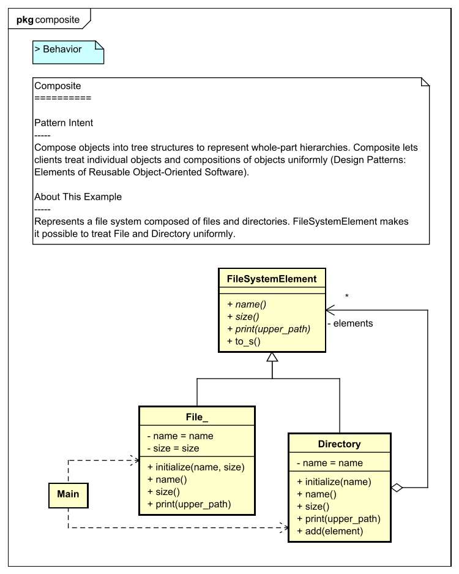

[](https://raw.githubusercontent.com/takaakit/design-pattern-examples-in-ruby/master/screenshots/DiagramMap.svg)

Design Pattern Examples in Ruby
===

Model and code examples of GoF Design Patterns for Ruby.  
This project is available for the following objectives:  

* To try Model-Driven Development (MDD) using Astah and M PLUS plug-in.
* To understand the mapping between UML model and Ruby code.
* To understand GoF Design Pattern examples in Ruby.  
  etc.

> UML model example:



> Ruby code example:

```ruby:File class
#!/usr/bin/env ruby
# -*- coding: utf-8 -*-
# ˅
require_relative 'file_system_element'

# ˄

# Since class name of "File" can not be used duplicately, the class name is "File_".
class File_ < FileSystemElement
  # ˅
  
  # ˄

  public
  def initialize(name, size)

    @name = name

    @size = size

    # ˅

    # ˄
  end

  public
  def name
    # ˅
    return @name
    # ˄
  end

  public
  def size
    # ˅
    return @size
    # ˄
  end

  # Print this element with the "upperPath".
  public
  def print(upper_path)
    # ˅
    puts "#{upper_path}/#{self}"
    # ˄
  end

  # ˅
  
  # ˄
end

# ˅

# ˄
```

Installation
------------
**Astah**
* Download Astah UML or Professional from [Change Vision site](http://astah.net/download), and install.  

**M PLUS plug-in**
* Download the plug-in from [M PLUS plug-in site](https://sites.google.com/view/m-plus-plugin/download), and install.  
  **Use ver.2.5.0 or higher.**

**Development Environment for Ruby**
* Install [Ruby](https://www.ruby-lang.org/en/downloads/) and [Ruby/Tk](https://github.com/ruby/tk#installation). The operation has been confirmed in Ruby **3.0.1** and Ruby/Tk **0.4.0** on Windows 10.
* Prepare an arbitrary development environment for Ruby (e.g. [RubyMine](https://www.jetbrains.com/ruby/download/), [Eclipse](http://www.eclipse.org/downloads/eclipse-packages/)).

Usage
-----
* Select model elements on the model browser of Astah, and press the "Generate code" button to generate.  
* The generated code has "User Code Area". The "User Code Area" is the area enclosed by "˅" and "˄". Handwritten code written in the "User Code Area" remains after a re-generation.
* You can run the program from "main.rb" for each Design Pattern.
* For detailed usage of the tools, please see [Astah Manual](http://astah.net/manual) and [M PLUS plug-in Tips](https://sites.google.com/view/m-plus-plugin-tips).


References
----------
* Gamma, E. et al. Design Patterns: Elements of Reusable Object-Oriented Software, Addison-Wesley, 1994
* Hiroshi Yuki. Learning Design Patterns in Java [In Japanese Language], Softbank publishing, 2004

Licence
-------
This project is licensed under the Creative Commons Zero (CC0) license. The model and code are completely free to use.

[](http://creativecommons.org/publicdomain/zero/1.0/deed)
